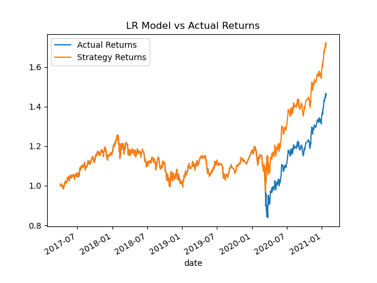

# Machine Learning Trading Bot
#### By Joshua Woods

Now, it's time to take what you've learned about machine learning and apply it to new situations. For this optional assignment, you'll create an algorithmic trading bot that learns and adapts to new data and evolving markets. Be sure to give it your all -- as the skills you hone will become powerful tools in your FinTech tool belt.

## Background

In this Challenge, you’ll assume the role of a financial advisor at one of the top five financial advisory firms in the world. Your firm constantly competes with the other major firms to manage and automatically trade assets in a highly dynamic environment. In recent years, your firm has heavily profited by using computer algorithms that can buy and sell faster than human traders.

The speed of these transactions gave your firm a competitive advantage early on. But, people still need to specifically program these systems, which limits their ability to adapt to new data. You’re thus planning to improve the existing algorithmic trading systems and maintain the firm’s competitive advantage in the market. To do so, you’ll enhance the existing trading signals with machine learning algorithms that can adapt to new data.

## What You're Creating

You’ll combine your new algorithmic trading skills with your existing skills in financial Python programming and machine learning to create an algorithmic trading bot that learns and adapts to new data and evolving markets.

In a Jupyter notebook, you’ll do the following:

* Implement an algorithmic trading strategy that uses machine learning to automate the trade decisions.

* Adjust the input parameters to optimize the trading algorithm.

* Train a new machine learning model and compare its performance to that of a baseline model.

As part of your GitHub repository’s `README.md` file, you will also create a report that compares the performance of the machine learning models based on the trading predictions that each makes and the resulting cumulative strategy returns.

## Instructions

Use the starter code file to complete the steps that the instructions outline. The steps for this Challenge are divided into the following sections:

* Establish a Baseline Performance

* Tune the Baseline Trading Algorithm

* Evaluate a New Machine Learning Classifier

* Create an Evaluation Report

### Establish a Baseline Performance

In this section, you’ll run the provided starter code to establish a baseline performance for the trading algorithm. To do so, complete the following steps.

Open the Jupyter notebook. Restart the kernel, run the provided cells that correspond with the first three steps, and then proceed to step four.

1. Import the OHLCV dataset into a Pandas DataFrame.

2. Generate trading signals using short- and long-window SMA values.

3. Split the data into training and testing datasets.

4. Use the SVC classifier model from SKLearn's support vector machine (SVM) learning method to fit the training data and make predictions based on the testing data. Review the predictions.

5. Review the classification report associated with the SVC model predictions.

6. Create a predictions DataFrame that contains columns for “Predicted” values, “Actual Returns”, and “Strategy Returns”.

7. Create a cumulative return plot that shows the actual returns vs. the strategy returns. Save a PNG image of this plot. This will serve as a baseline against which to compare the effects of tuning the trading algorithm.  

8. Write your conclusions about the performance of the baseline trading algorithm in the `README.md` file that’s associated with your GitHub repository. Support your findings by using the PNG image that you saved in the previous step.

As you can see from the above plot the original SVM model strategy outperformed the actual returns, which is a buy and hold strategy. The SVM original model performed pretty well. There was only a short period in 2018 were it was under performing the buy and hold strategy. 

### Tune the Baseline Trading Algorithm

In this section, you’ll tune, or adjust, the model’s input features to find the parameters that result in the best trading outcomes. (You’ll choose the best by comparing the cumulative products of the strategy returns.) To do so, complete the following steps:

1. Tune the training algorithm by adjusting the size of the training dataset. To do so, slice your data into different periods. Rerun the notebook with the updated parameters, and record the results in your `README.md` file. Answer the following question: What impact resulted from increasing or decreasing the training window?  

Increasing the training window improved the model by about 10% overall. I increased the training window to 24 months to allow the model to train for bullish and bearish trends which seemed to help. The model also limited the drawdown and closely followed the actual returns until the big draw-down in 2020 which is interesting.  

2. Tune the trading algorithm by adjusting the SMA input features. Adjust one or both of the windows for the algorithm. Rerun the notebook with the updated parameters, and record the results in your `README.md` file. Answer the following question: What impact resulted from increasing or decreasing either or both of the SMA windows?  

This model I increased the short window to a 26 period and kept the training window at 24 months. This model did not perform well at all. You can see by the plot the model under performed the actual returns the whole time and had a draw down from 2017 to 2020. 

3. Choose the set of parameters that best improved the trading algorithm returns. Save a PNG image of the cumulative product of the actual returns vs. the strategy returns, and document your conclusion in your `README.md` file.

### Evaluate a New Machine Learning Classifier

In this section, you’ll use the original parameters that the starter code provided. But, you’ll apply them to the performance of a second machine learning model. To do so, complete the following steps:

1. Import a new classifier, such as AdaBoost, DecisionTreeClassifier, or LogisticRegression. (For the full list of classifiers, refer to the [Supervised learning page](https://scikit-learn.org/stable/supervised_learning.html) in the scikit-learn documentation.)

2. Using the original training data as the baseline model, fit another model with the new classifier.

3. Backtest the new model to evaluate its performance. Save a PNG image of the cumulative product of the actual returns vs. the strategy returns for this updated trading algorithm, and write your conclusions in your README.md file. Answer the following questions: Did this new model perform better or worse than the provided baseline model? Did this new model perform better or worse than your tuned trading algorithm?

### Evaluation Report
The new machine learning classifier I decided to use was Logistic Regression. The LR model was actually very similar the the SVM 24 month training model which was very interesting.   

Both the 24 month SVM and LR model followed the actual returns very closely until the big draw-down in 2020 where both the models started to outperform due to reducing the losses in the draw down. I find it very interesting in how both of these model performed similar. Some more investigation may need to be done on these model to figure how why. With the data I have I believe the LR model performed the best due to the slightly lower draw-down, therefor I recommend that model to be used. 

---
README orginally created by edX Boot Camps LLC. README updated by Joshua Woods with home work analysis. 
© 2022 edX Boot Camps LLC. Confidential and Proprietary. All Rights Reserved.
